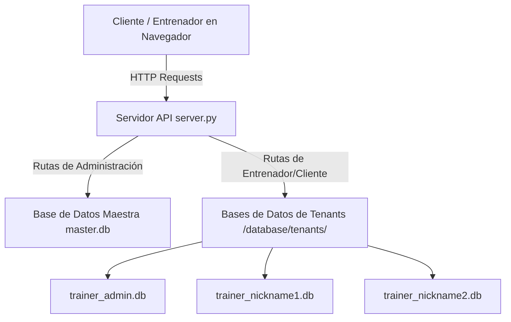
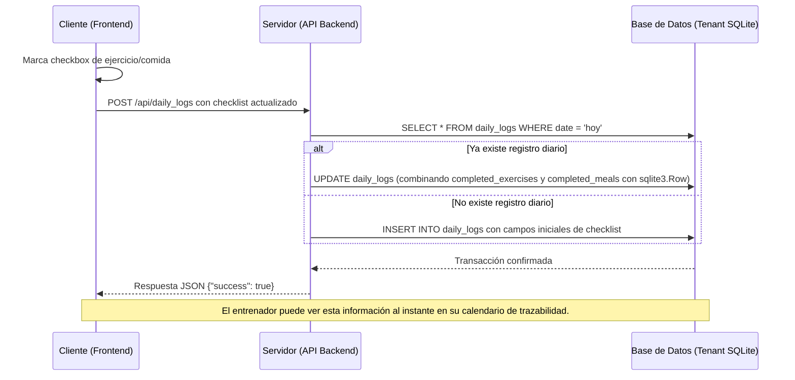
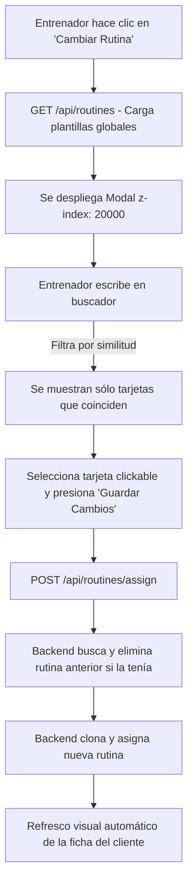

# Bitácora de Desarrollo y Arquitectura Técnica - Elite Fitness

Este documento sirve como la guía técnica oficial y bitácora de control sobre el diseño, flujo de datos, arquitectura de backend/frontend y registro histórico de cambios implementados en la plataforma.

---

## 1. Arquitectura del Sistema (Multi-Tenancy)

La plataforma utiliza una arquitectura multi-inquilino (multi-tenant) basada en bases de datos SQLite separadas por cada entrenador (aislamiento a nivel de base de datos) para garantizar la privacidad y escalabilidad del servicio.

### Componentes de Datos:
* **Base de Datos Maestra (`database/master.db`)**: Gestiona las credenciales de acceso de los entrenadores y la asignación de subdominios/apodos de inquilinos.
* **Bases de Datos de Tenants (`database/tenants/trainer_{nickname}.db`)**: Cada base de datos contiene los clientes, evaluaciones físicas, biblioteca de ejercicios, comidas, rutinas, planes nutricionales y logs diarios de un entrenador específico.
* **Sembrado Automático**: Al registrar un nuevo entrenador, `server.py` copia la biblioteca de ejercicios y de alimentos de `trainer_admin.db` (o usa los valores por defecto si no existe) para que cada inquilino empiece con un catálogo enriquecido.

---

## 2. Diagramas de Flujo y Lógica de Procesos

### A. Registro y Sincronización del Checklist Diario
El portal del cliente interactúa con su bitácora de rutina y alimentación diaria. Las acciones de marcar ejercicios o comidas completadas se persisten en tiempo real en la base de datos sin recargar la página.

### B. Flujo de Cambio de Rutina (Cambiar Rutina)
Unifica la funcionalidad de asignación y desasignación en un único flujo de búsqueda rápida.

---

## 3. Especificaciones del Backend (API REST)

El backend corre en `server.py` y se encarga del enrutamiento de peticiones HTTP, manejo de sesiones de autenticación de entrenadores y clientes, y de la persistencia de datos.

### Endpoints Clave:
* **`POST /api/routines/assign`**: Asigna una plantilla de rutina a un cliente. Limpia de manera automática todos los registros anteriores del plan de entrenamiento activo de dicho cliente en cascada.
* **`DELETE /api/routines`**: Desasigna un plan de entrenamiento activo a través de su identificador único.
* **`POST /api/daily_logs`**: Guarda o actualiza el progreso diario del cliente. Implementa lógica de mezcla segura usando `sqlite3.Row` para evitar la sobreescritura accidental de checklists de días pasados al guardar peso o hidratación.
* **`GET /api/daily_logs/calendar`**: Devuelve el historial mensual de registros diarios de un cliente para poblar el calendario de trazabilidad del entrenador.

---

## 4. Especificaciones del Frontend y UI/UX

La interfaz de usuario está diseñada bajo un sistema visual moderno de tipo *Dark Glassmorphism* (Efecto cristal translúcido sobre fondo oscuro con acentos neón y oro).

### Arquitectura de Capas de Interfaz (Z-Index):
Para asegurar la correcta visualización de elementos interactivos sobre dispositivos móviles y vistas de escritorio:
* **Fondo general y barras laterales**: Capa base.
* **Ficha deslizable del cliente móvil (`.main-content.mobile-open`)**: Se renderiza de forma fija cubriendo la pantalla completa con un **`z-index: 10000`**.
* **Ventanas Emergentes / Modales (`div[id*='Modal']`)**: Todos los modales se configuran con un **`z-index: 20000 !important`** (sobreescribiendo estilos en línea en `style.css` y configurado en `trainer.js`) para evitar que queden ocultos detrás del panel de la ficha deslizable del cliente en teléfonos móviles.

---

## 5. Bitácora de Versiones e Implementaciones

### Versión 2.0.3 (Última actualización)
* **Checklists dinámicos de cliente**: Casillas para marcar ejercicios y alimentos en tiempo real, persistidos en `daily_logs` del backend.
* **Flujo unificado 'Cambiar Rutina'**: Botón único, buscador dinámico con filtro de similitud instantáneo, tarjetas clickables e inicio deshabilitado del botón guardar hasta seleccionar opción.
* **Sembrado automático multi-inquilino**: Copia automática de catálogos desde `trainer_admin.db` para nuevos entrenadores registrados.
* **Fix de z-index y capas en móviles**: Modales reajustados a `z-index: 20000` para mostrarse correctamente por encima del panel de clientes.
* **Fix de duplicación de IDs en Trazabilidad**: Remoción del panel en línea `dayDetailPanel` y unificación de la inyección de datos del calendario de reportes exclusivamente dentro del modal flotante `dayDetailModal`.
* **Landing de cliente limpio**: El dashboard del entrenador carga en una tarjeta de bienvenida general en lugar de abrir el primer cliente de golpe.
* **Sliders actualizados**: Los inputs de rango de sueño y dieta en el cliente actualizan su valor numérico en vivo.

### Versión 2.0.2
* **Edición de valoraciones físicas**: Se implementó `PUT /api/assessments` y su correspondiente formulario de edición antropométrica.
* **Breakpoint horizontal responsivo**: Modificación de breakpoints globales de `768px` a `1024px` para mantener la UI móvil en modos horizontales (landscape) en tablets y smartphones.
* **Organización de KPIs y tablas compactas**: KPIs antropométricos encuadrados de forma ordenada y tablas con scroll horizontal nativo y fuentes de `11px` para maximizar densidad de información.
