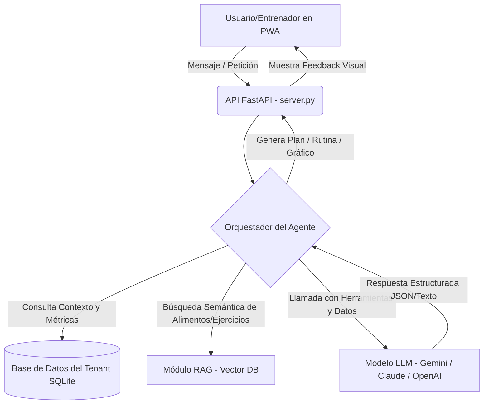
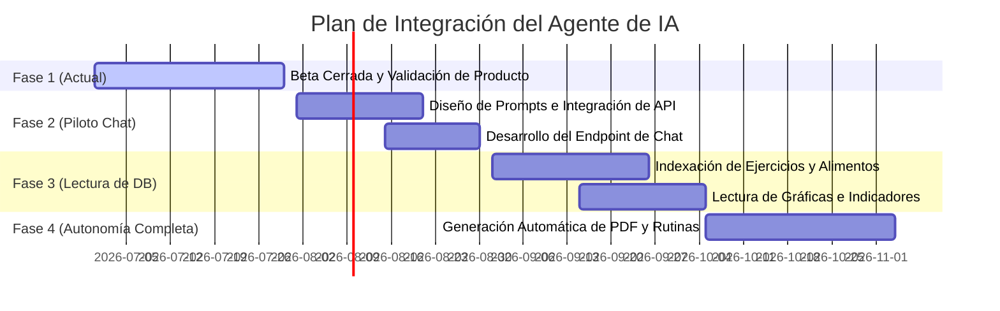
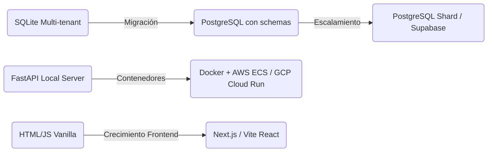

# 🧠 Informe de Investigación y Arquitectura: Agente de IA en ELITE FTNS

Este documento detalla la investigación, recursos, costos, pros/contras y la hoja de ruta para la creación e integración de nuestro propio **Agente de Inteligencia Artificial** en la plataforma **ELITE FTNS**.

El agente estará diseñado para:
1. **Asistir en la creación de rutinas** de entrenamiento y planes de alimentación basados en características del usuario.
2. **Interpretar y comentar gráficas** e indicadores de trazabilidad del cliente (peso, pasos, sueño, apego a la dieta).
3. **Consultar las bases de datos de alimentos y ejercicios** propias para generar planes personalizados y realistas.

---

## 1. Arquitectura y Capacidades del Agente

Para que el agente de IA sea realmente útil y eficiente, debe estructurarse utilizando un patrón de **Agente con herramientas (Tool-Use Agent)** y **RAG (Retrieval-Augmented Generation)** en lugar de ser un simple chatbot de texto.

### Funciones Principales de la IA

*   **Asistente de Rutinas y Nutrición**: El agente podrá acceder a la base de datos de ejercicios y alimentos a través de herramientas de búsqueda de base de datos.
    *   *Ejemplo*: "Crea una rutina de empuje enfocada en el pectoral superior de 45 minutos con el equipamiento disponible: mancuernas". El agente consultará la tabla `exercises` filtrando por `primary_muscle = 'Pectoral'` y `equipment = 'Mancuernas'`.
*   **Lectura e Interpretación de Indicadores**: El agente leerá los registros antropométricos (`anthropometric_assessments`), el historial de pliegues (`skinfold_assessments`) y la bitácora diaria del cliente (`daily_logs`).
    *   *Ejemplo*: Analizará la gráfica del cliente de los últimos 14 días y dará un diagnóstico: *"Hemos visto un descenso del peso corporal de 0.8 kg coincidiendo con un aumento promedio de 2,000 pasos diarios, sin embargo, la calidad de sueño se ha deteriorado en los días con bajo apego a la hidratación. Sugiero aumentar el agua a 2.5L en los días de entrenamiento duro"*.

---

## 2. Opciones de Modelos de Lenguaje (LLMs): Pros, Contras y Precios

Para implementar el motor cerebral del agente, evaluamos tres enfoques principales. 

### Comparativa General de Proveedores de LLM

| Proveedor / Modelo | Pros | Contras | Costo Estimado (por 1M Tokens Entrada/Salida) | Recomendación |
| :--- | :--- | :--- | :--- | :--- |
| **Gemini 1.5 Flash / 2.0 Flash (Google)** | <ul><li>Ventana de contexto ultra grande (1M-2M tokens)</li><li>Precio extremadamente económico</li><li>Excelente velocidad de respuesta</li><li>Integración nativa con Python y estructuración JSON</li></ul> | <ul><li>Menor popularidad en tutoriales clásicos que OpenAI, aunque el SDK es muy sencillo.</li></ul> | Entrada: **$0.075 USD** Salida: **$0.30 USD** *(Precios de Gemini 1.5 Flash)* | **Altamente Recomendado** para la fase inicial y de escalado por costo/beneficio. |
| **OpenAI GPT-4o / GPT-4o-mini** | <ul><li>Estándar de la industria con abundante documentación</li><li>GPT-4o-mini es muy rápido y económico</li><li>Soporte nativo excelente para Function Calling (herramientas)</li></ul> | <ul><li>GPT-4o es costoso para tareas repetitivas</li><li>Límites de cuota estrictos en cuentas nuevas</li></ul> | **GPT-4o-mini:** Entrada: **$0.15 USD** Salida: **$0.60 USD** | Excelente alternativa secundaria. |
| **Claude 3.5 Sonnet (Anthropic)** | <ul><li>El modelo más inteligente del mercado para razonamiento complejo y codificación</li><li>Genera las explicaciones de mayor calidad y tono más natural</li></ul> | <ul><li>Costo significativamente elevado</li><li>Velocidad de generación moderada</li></ul> | Entrada: **$3.00 USD** Salida: **$15.00 USD** | Ideal solo para análisis complejos de reportes antropométricos avanzados. |
| **Llama 3 (Open Source - Hosteado)** *(vía Groq, Together AI o self-hosted)* | <ul><li>Privacidad total de datos si es self-hosted</li><li>Velocidad de inferencia brutalmente rápida (Groq)</li><li>Sin riesgo de bloqueos de API comerciales</li></ul> | <ul><li>Requiere configurar infraestructura propia (GPU) o pagar proveedores Cloud intermedios</li><li>Menos robusto en estructuración JSON compleja</li></ul> | **Groq (Llama 3 70B):** Entrada: **$0.59 USD** Salida: **$0.79 USD** | Ideal si el volumen es masivo o se requiere alojamiento local/on-premise. |

---

## 3. Tecnologías y Frameworks de Agentes Recomendados

Para dotar a la IA de la capacidad de interactuar con nuestra base de datos SQLite y razonar sobre los datos del cliente, se recomiendan los siguientes recursos de desarrollo en Python:

1.  **LangGraph (de LangChain)**:
    *   *Por qué*: Permite crear flujos de agentes cíclicos basados en grafos de estado. Es perfecto para crear un agente que primero "analice la petición", luego "busque ejercicios/alimentos", y finalmente "valide si el plan cumple las calorías requeridas".
2.  **LlamaIndex**:
    *   *Por qué*: Es la biblioteca líder para conectar datos privados con LLMs. Simplifica el proceso de indexar la base de datos de alimentos y ejercicios para realizar buscas semánticas (ej. buscar alimentos altos en proteína que no contengan gluten).
3.  **FastAPI Agent Endpoints**:
    *   *Por qué*: Como nuestro servidor actual ya está desarrollado en FastAPI, podemos integrar rutas de Websockets para chat interactivo en vivo (`/api/v1/chat/ws`) o endpoints REST tradicionales para la generación asíncrona de planes.

---

## 4. Hoja de Ruta de Integración por Fases del Proyecto

Actualmente, el proyecto se encuentra en la **Fase 1 (Beta Cerrada y Estudio de Mercado)**. A continuación se propone cómo incorporar el agente de IA de forma progresiva:

### Detalle de las Fases:

*   **Fase 1 (Fase Actual - Consolidación)**:
    *   Mantener el sistema libre de IA para asegurar estabilidad y medir costos del servidor básico.
    *   Definir el modelo de base de datos definitivo. (Nota: en la tabla `exercises` de `schema.sql` y `food_library` ya contamos con las tablas estructuradas para el almacenamiento de ejercicios y alimentos de forma local en cada base de datos del entrenador).
*   **Fase 2 (Chat de Asistencia Básica - Piloto)**:
    *   Crear una interfaz de chat en el portal de entrenador y cliente.
    *   Conectar el chat a la API de **Gemini 1.5 Flash** pasándole el perfil básico del usuario como texto plano (peso, altura, objetivo). El agente dará respuestas basadas en conocimientos generales del LLM.
*   **Fase 3 (Lectura Dinámica de la Base de Datos - RAG)**:
    *   Integrar herramientas de base de datos a la IA. Mediante consultas SQL controladas (para evitar SQL Injections generadas por IA), la IA podrá buscar alimentos reales en `food_library` o ejercicios en `exercises`.
    *   Implementar análisis de gráficas. Cuando el entrenador solicite una opinión de progreso, el backend enviará a la IA un resumen JSON del historial de `daily_logs` y `anthropometric_assessments`. La IA devolverá un análisis estructurado.
*   **Fase 4 (Generación y Asignación Automatizada)**:
    *   La IA no solo sugiere, sino que **escribe directamente en las tablas**. Por ejemplo, al aprobar la propuesta de rutina de la IA, el entrenador presiona "Aplicar" y el sistema crea automáticamente las entradas correspondientes en `workout_plans`, `workout_days` y `workout_exercises`.

---

## 5. Plan de Migración Tecnológica: ¿Cuándo y Cómo?

El sistema actual corre bajo un stack ligero e ideal para prototipado y validación rápida: **FastAPI + SQLite (Multi-tenant por archivo) + PWA en archivos estáticos**.

### ¿Cuándo necesitaremos migrar a otro sistema?

Recomendamos iniciar la migración cuando se cumplan al menos 2 de los siguientes desencadenantes (triggers):

1.  **Volumen de Usuarios**: Superar los 100 entrenadores activos con más de 2,000 clientes concurrentes en total.
2.  **Complejidad de Búsqueda de IA**: Cuando necesitemos búsquedas vectoriales avanzadas integradas (ej. buscar ejercicios similares basados en descripciones semánticas complejas).
3.  **Necesidad de Analítica Cruzada**: Cuando el administrador necesite hacer consultas SQL agregadas de todos los entrenadores a la vez (en SQLite, al tener un archivo `.db` por entrenador, hacer analítica global es complejo porque requiere conectarse a múltiples archivos).

### Roadmap de Migración (Destino Sugerido)

1.  **Migración de Base de Datos (SQLite ➔ PostgreSQL)**:
    *   *Por qué*: PostgreSQL permite aislamiento multi-inquilino mediante diferentes esquemas o bases de datos lógicas en un solo servidor de base de datos central.
    *   *Soporte de IA*: PostgreSQL soporta la extensión `pgvector`, que nos permitirá almacenar y buscar embeddings vectoriales de los ejercicios y alimentos directamente dentro de la base de datos sin agregar servicios extra.
2.  **Migración de Backend y Hosting (Local / Render ➔ Docker + AWS/GCP)**:
    *   *Por qué*: Los agentes de IA pueden ser pesados en memoria (si se usan vectorizadores locales) o requerir procesamiento asíncrono largo.
    *   *Solución*: Empaquetar la aplicación FastAPI en un contenedor Docker y desplegar en servicios auto-escalables como **GCP Cloud Run** o **AWS ECS**, con una cola de tareas como **Celery** o **Redis Queue** para procesar los reportes de la IA en segundo plano.
3.  **Migración de Frontend (Vanilla HTML/JS ➔ React/Vite)**:
    *   *Por qué*: A medida que los chats interactivos de IA y los dashboards interactivos de gráficas aumenten, el manejo de estados en JS plano se vuelve engorroso. Un framework de frontend modular facilitará la reutilización de componentes complejos.
