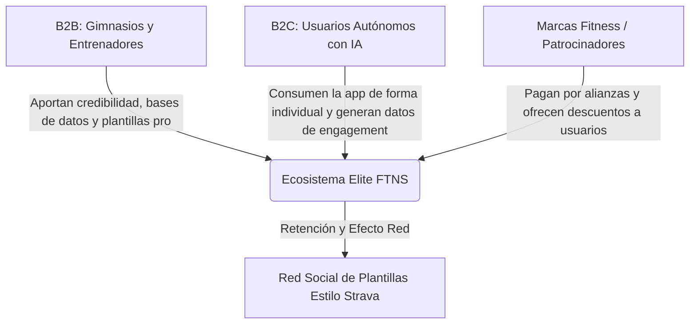
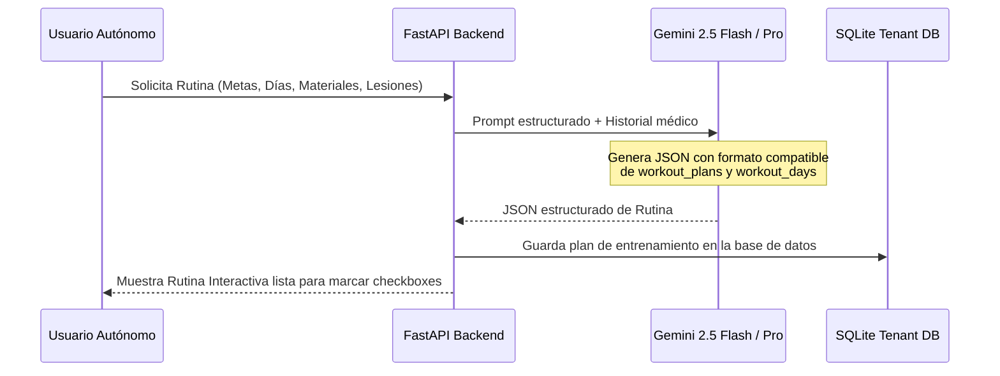
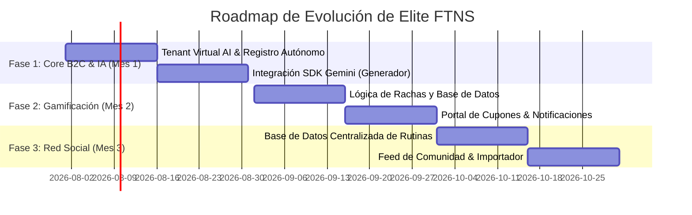

# Roadmap de Evolución: Elite FTNS v3.0 - De SaaS B2B a Ecosistema B2C con IA, Gamificación y Red Social

Este documento presenta la propuesta de arquitectura técnica, el diseño de base de datos y la estrategia de producto para la migración de **Elite Coaching** (plataforma orientada a gimnasios y entrenadores premium) hacia un modelo híbrido que incorpore **usuarios autónomos (B2C)** impulsados por un **Agente de Inteligencia Artificial**, **gamificación por marcas** y una **red social de plantillas**.

---

## 🗺️ 1. Visión General del Modelo de Negocio

El ecosistema evolucionará en tres grandes nichos que se alimentan mutuamente:



---

## 🛠️ 2. Adaptación de la Arquitectura Multi-Tenant Actual

### El Desafío
Actualmente, la plataforma utiliza un esquema **multi-tenant aislado por archivo de base de datos** (`trainer_<nickname>.db`) para garantizar la privacidad de los clientes de cada gimnasio/entrenador. Los usuarios autónomos (B2C) no tienen un entrenador humano asignado.

### La Solución Propuesta
Para no romper el diseño actual ni requerir una migración masiva a una base de datos centralizada única (lo que degradaría el rendimiento y la privacidad actual), crearemos un **Tenant Virtual de Inteligencia Artificial** en la base de datos maestra y de inquilinos.

1. **El Entrenador Virtual (`trainer_ai`):**
   * En `master.db`, registramos un entrenador por defecto con el nickname `elite_ai` y la bandera `is_system_ai = 1`.
   * Todos los usuarios independientes B2C que se registren en la plataforma de manera autónoma se asignan automáticamente al tenant `trainer_elite_ai.db`.
   * De esta forma, el backend FastAPI sigue consumiendo la base de datos de inquilino de la misma manera que lo hace para cualquier otro entrenador. El "entrenador" que realiza las peticiones a la API es el Agente de IA.

2. **Base de Datos Centralizada de Alianzas y Social (`master.db`):**
   * El módulo social (plantillas públicas, feed) y el módulo de marcas (cupones y campañas) deben ser accesibles por todos los tenants. Por lo tanto, estas tablas se añadirán a la base de datos central `master.db`.

---

## 🤖 3. Arquitectura del Agente de Inteligencia Artificial (IA Coach)

El Agente de IA actuará en tres frentes: **Entrenamiento**, **Nutrición** y **Análisis de Métricas**.



### Flujo de Generación Estructurada
Para asegurar que la IA no entregue solo texto plano inútil, utilizaremos **Structured Outputs** (salidas estructuradas JSON) del modelo de lenguaje (ej. Gemini 2.5/3.5). La estructura devuelta mapeará directamente a las tablas de la base de datos:

* **Para Entrenamiento:** Genera un JSON compatible con la tabla `workout_plans` (con sus respectivos `workout_days`, `workout_day_blocks` y `workout_exercises`).
* **Para Nutrición:** Genera una estructura compatible con `nutrition_plans` (con sus calorías/macros objetivos, `meals` y `meal_items` referenciados a la base de datos de la USDA que tenemos sembrada).

### Análisis de Progreso
Mensual o semanalmente, un trigger leerá la tabla `daily_logs` (adherencia a dieta, peso corporal, agua, pasos, sueño) y `workout_execution_logs` (fuerza de levantamiento por ejercicio, RPE, volumen de entrenamiento).
El Agente generará un reporte dinámico:
> *"Hola Carlos. He notado que tu fuerza en Sentadilla ha aumentado un 8% en las últimas 3 semanas, pero tu calidad de sueño promedio los días de pierna bajó a 6.2/10. He ajustado tu volumen del miércoles reduciendo 1 serie de prensa para optimizar tu recuperación."*

---

## 🎮 4. Módulo de Gamificación y Alianzas con Marcas

Implementaremos un motor de rachas diarias y redención de cupones mediante patrocinadores.

### Diseño de Base de Datos Propuesto (en `master.db`)

```sql
-- 1. Tabla de marcas patrocinadoras
CREATE TABLE IF NOT EXISTS sponsor_brands (
    id INTEGER PRIMARY KEY AUTOINCREMENT,
    name TEXT NOT NULL,
    logo_url TEXT,
    website_url TEXT,
    category TEXT -- e.g., 'Suplementos', 'Ropa', 'Accesorios'
);

-- 2. Tabla de campañas de cupones de descuento
CREATE TABLE IF NOT EXISTS coupons (
    id INTEGER PRIMARY KEY AUTOINCREMENT,
    brand_id INTEGER NOT NULL,
    title TEXT NOT NULL, -- e.g., '20% OFF en Proteína Whey'
    description TEXT,
    promo_code TEXT NOT NULL, -- El código real (ej. ELITEWHEY20)
    streak_required INTEGER NOT NULL DEFAULT 7, -- Racha necesaria en días
    max_redemptions INTEGER, -- Límite de stock
    current_redemptions INTEGER DEFAULT 0,
    is_active BOOLEAN DEFAULT 1,
    FOREIGN KEY (brand_id) REFERENCES sponsor_brands(id) ON DELETE CASCADE
);

-- 3. Tabla de control de rachas de usuarios
CREATE TABLE IF NOT EXISTS user_streaks (
    user_uuid TEXT PRIMARY KEY, -- UUID global o combinacion tenant_id + user_id
    current_streak INTEGER DEFAULT 0,
    longest_streak INTEGER DEFAULT 0,
    last_report_date DATE
);

-- 4. Registro de cupones reclamados por los usuarios
CREATE TABLE IF NOT EXISTS user_claimed_coupons (
    id INTEGER PRIMARY KEY AUTOINCREMENT,
    user_uuid TEXT NOT NULL,
    coupon_id INTEGER NOT NULL,
    claimed_at TIMESTAMP DEFAULT CURRENT_TIMESTAMP,
    is_redeemed BOOLEAN DEFAULT 0,
    FOREIGN KEY (coupon_id) REFERENCES coupons(id) ON DELETE CASCADE
);
```

### Lógica de Cálculo de Rachas (Streaks)
Cuando el cliente envía su reporte diario (`daily_logs`) o completa una sesión de entrenamiento (`workout_execution_logs`), el servidor ejecuta una función para actualizar su racha:

1. Si `last_report_date` es **ayer**, `current_streak` aumenta en `+1`.
2. Si `last_report_date` es **hoy**, se mantiene igual (ya reportó hoy).
3. Si `last_report_date` es **anterior a ayer**, la racha se rompe y se reinicia en `1`.
4. Si `current_streak` es mayor que `longest_streak`, actualizamos `longest_streak`.

Al cumplir el hito de racha (ej. 7 días seguidos), el cliente recibe una notificación dentro de la app para reclamar su cupón.

---

## 🌐 5. Red Social de Plantillas (Estilo Strava)

Para fomentar el efecto de red y la viralidad del producto, los usuarios podrán publicar sus planes favoritos en un repositorio centralizado.

### Flujo de Publicación y Descarga

```
[Usuario en su Portal] -> Clic en "Publicar Plan"
                         |
                         v
   Extrae datos de la BD del Tenant (Rutina/Dieta)
                         |
                         v
   Crea copia anónima en tabla central 'community_templates' en master.db
                         |
                         v
[Cualquier otro usuario] -> Busca en la pestaña de Comunidad -> Clic en "Importar"
                         |
                         v
   Inserta los datos en la base de datos de su propio Tenant
```

### Tabla de Plantillas de la Comunidad (en `master.db`)
```sql
CREATE TABLE IF NOT EXISTS community_templates (
    id INTEGER PRIMARY KEY AUTOINCREMENT,
    creator_uuid TEXT NOT NULL,
    creator_name TEXT NOT NULL,
    template_type TEXT NOT NULL, -- 'workout' o 'nutrition'
    title TEXT NOT NULL,
    description TEXT,
    likes_count INTEGER DEFAULT 0,
    clones_count INTEGER DEFAULT 0,
    data_json TEXT NOT NULL, -- El JSON completo de la rutina/dieta (días, ejercicios, comidas)
    created_at TIMESTAMP DEFAULT CURRENT_TIMESTAMP
);
```

---

## 📈 6. Plan de Fases para el Lanzamiento



### Fase 1: El Entrenador de Inteligencia Artificial (Core Autónomo)
* **Objetivo:** Permitir que usuarios independientes se registren, paguen una suscripción individual de menor coste, y tengan una experiencia interactiva guiada por IA en lugar de un entrenador humano.
* **MVP:** Un chat conversacional dentro de la sección "Mi Entrenador" del portal de cliente, donde la IA puede construir la rutina/dieta y añadirla directamente a su calendario.

### Fase 2: Gamificación, Retención y Patrocinios
* **Objetivo:** Incrementar la retención diaria de los usuarios (reducción del churn) ofreciéndoles recompensas físicas por su constancia.
* **MVP:** Sistema de racha de 7/14/30 días. Integración manual de cupones de 3 o 4 marcas colaboradoras locales (suplementación, ropa deportiva, comida saludable).

### Fase 3: Red Social y Comunidad ("Elite Hub")
* **Objetivo:** Crear un foso competitivo (moat) basado en efecto de red. Si los amigos del usuario están en la app compartiendo sus entrenamientos, el costo de cambiarse a otra aplicación es muy alto.
* **MVP:** Buscador de rutinas creadas por otros usuarios, ranking de constancia del mes, y opción de dar "kudos" (likes) a los entrenamientos completados por compañeros.

---

Este plan permite que **Elite FTNS** pase de ser un software SaaS de nicho cerrado a un ecosistema fitness auto-sostenible con un modelo de monetización doble: **Suscripción de Usuarios Autónomos + Comisión/Publicidad de Marcas Patrocinadoras**.
