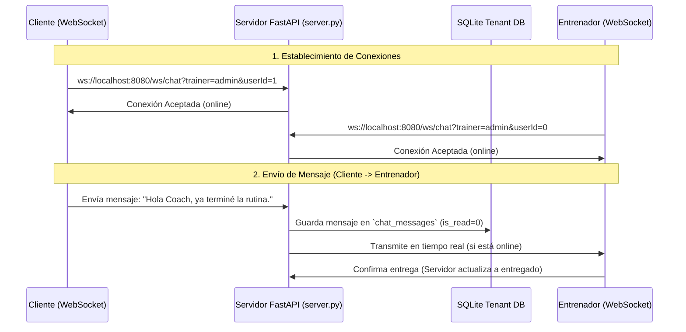

# Plan de Implementación: Chat en Tiempo Real (Estilo WhatsApp / Messenger)

Este documento detalla la propuesta técnica, la arquitectura y los cambios de interfaz de usuario para integrar un chat en tiempo real dentro de la plataforma Elite Coaching, permitiendo comunicación bidireccional inmediata entre el Entrenador y sus Clientes.

---

## Arquitectura Propuesta

La comunicación en tiempo real se implementará mediante **WebSockets** sobre el servidor actual de FastAPI (Uvicorn), aprovechando el protocolo ASGI nativo. Dado que cada entrenador (tenant) opera con su propio archivo de base de datos SQLite con modo **WAL (Write-Ahead Logging)** activo, las lecturas y escrituras concurrentes se realizarán de manera eficiente sin bloquear las conexiones.



---

## Módulos del Sistema

### 1. Base de Datos (SQLite)
Se agregará la tabla `chat_messages` dentro de la base de datos de cada entrenador (ej. `database/tenants/trainer_admin.db`).

#### [NEW] Módulos de Migración (`database/schema.sql`)
```sql
CREATE TABLE IF NOT EXISTS chat_messages (
    id INTEGER PRIMARY KEY AUTOINCREMENT,
    sender_id INTEGER NOT NULL,      -- ID del usuario emisor (ej: client_id o 0 para entrenador)
    receiver_id INTEGER NOT NULL,    -- ID del usuario receptor
    message TEXT NOT NULL,
    is_read BOOLEAN DEFAULT 0,       -- 0 = No leído, 1 = Leído
    created_at TIMESTAMP DEFAULT CURRENT_TIMESTAMP
);

CREATE INDEX IF NOT EXISTS idx_chat_participants ON chat_messages(sender_id, receiver_id);
```

---

### 2. Backend (Servidor FastAPI)
Crearemos un gestor de conexiones (`ConnectionManager`) en `server.py` para llevar un registro de las conexiones de WebSockets activas.

#### [MODIFY] [server.py](file:///c:/Users/sonic/OneDrive/Escritorio/PR/server.py)
* **Gestor de Conexiones:**
```python
from typing import Dict, Tuple
from fastapi import WebSocket, WebSocketDisconnect

class ChatConnectionManager:
    def __init__(self):
        # Almacena conexiones activas bajo la clave (trainer_id, user_id)
        # El Entrenador siempre se registra como user_id = 0
        self.active_connections: Dict[Tuple[str, int], WebSocket] = {}

    async def connect(self, websocket: WebSocket, trainer: str, user_id: int):
        await websocket.accept()
        self.active_connections[(trainer, user_id)] = websocket

    def disconnect(self, trainer: str, user_id: int):
        self.active_connections.pop((trainer, user_id), None)

    async def send_message(self, message: dict, trainer: str, user_id: int):
        connection = self.active_connections.get((trainer, user_id))
        if connection:
            await connection.send_json(message)
            return True
        return False

chat_manager = ChatConnectionManager()
```
* **Endpoint WebSocket:**
```python
@app.websocket("/ws/chat")
async def websocket_chat_endpoint(websocket: WebSocket, trainer: str, userId: int):
    # Registrar la conexión activa del cliente o entrenador
    await chat_manager.connect(websocket, trainer, userId)
    try:
        while True:
            # Escucha mensajes entrantes
            data = await websocket.receive_json()
            
            # Formato esperado: {"receiver_id": int, "message": str}
            receiver_id = data.get("receiver_id")
            message_text = data.get("message")
            
            if receiver_id is not None and message_text:
                # 1. Guardar mensaje en base de datos del tenant
                msg_id = save_chat_message(trainer, userId, receiver_id, message_text)
                
                payload = {
                    "id": msg_id,
                    "sender_id": userId,
                    "receiver_id": receiver_id,
                    "message": message_text,
                    "created_at": datetime.utcnow().isoformat(),
                    "is_read": False
                }
                
                # 2. Transmitir en tiempo real al receptor si está online
                delivered = await chat_manager.send_message(payload, trainer, receiver_id)
                
                # 3. Responder al emisor para confirmar el envío (Single tick)
                await websocket.send_json({
                    "type": "sent_receipt",
                    "id": msg_id,
                    "receiver_id": receiver_id,
                    "delivered": delivered
                })
    except WebSocketDisconnect:
        chat_manager.disconnect(websocket, trainer, userId)
```

---

### 3. Interfaz de Usuario (Frontend)

El diseño del chat mantendrá una estética premium y minimalista coherente con el resto del ecosistema:

* **Estética Premium (WhatsApp / Messenger Style):**
  - **Burbujas de Texto:** Estilo translúcido glassmorphism (fondo oscuro con desenfoque `backdrop-filter: blur(10px)`). Los mensajes enviados por ti tendrán un color azul/cian brillante (`var(--accent-cyan)` con gradiente) y los recibidos un tono grisáceo translúcido.
  - **Ticks de Confirmación:**
    - ✓ (Gris): Mensaje guardado en el servidor.
    - ✓✓ (Gris): Mensaje entregado al receptor (está conectado).
    - ✓✓ (Azul/Verde): Mensaje leído.
  - **Online Status:** Un punto verde brillante junto a la foto o nombre del usuario indicando presencia en tiempo real.
  - **Notificaciones en tiempo real:** Indicadores numéricos rojos (ej. "3 mensajes nuevos") en los menús cuando no estés dentro de la conversación.

#### [NEW] Portal del Cliente (App Móvil)
Se agregará una nueva vista en `client.html` a la que se accede mediante el menú inferior (Bottom Navigation):
* **Pestaña de Chat:** Reemplaza o se suma a la barra inferior con el icono `fa-message`.
* **Diseño:** Pantalla de conversación completa con barra de entrada fija en el fondo, adaptada a safe-area.

#### [NEW] Portal del Entrenador (Web)
* **Pestaña/Pestaña Lateral en Ficha del Cliente:** Al abrir la ficha de un cliente, habrá una nueva pestaña llamada **"Chat"** que cargará el historial y permitirá hablar directamente con el usuario activo.

---

## Preguntas Abiertas

> [!IMPORTANT]
> Agradecería tus comentarios sobre estos puntos de diseño antes de iniciar la codificación:
> 1. **Push Notifications:** ¿Deseas notificaciones nativas en el móvil (utilizando el Service Worker y la API de Notificaciones del Navegador) cuando el usuario tenga la app cerrada o en segundo plano?
> 2. **Historial y Carga Paginada:** ¿Consideras adecuado limitar la carga inicial a los últimos 50 mensajes y cargar más al hacer scroll hacia arriba (infinite scroll)?

---

## Plan de Verificación

### Pruebas Automatizadas
* Crear un script en `scripts/test_chat_websocket.py` utilizando la librería `websockets` de Python para simular un cliente y un entrenador enviándose mensajes concurrentemente.

### Pruebas Manuales
1. Abrir el portal de entrenador y el de cliente en dos ventanas de navegador paralelas.
2. Escribir mensajes desde ambos portales y verificar la entrega instantánea (en menos de 100ms).
3. Desconectar una de las pestañas (simular pérdida de conexión), enviar un mensaje y verificar que al reconectarse se cargue del historial como pendiente.
